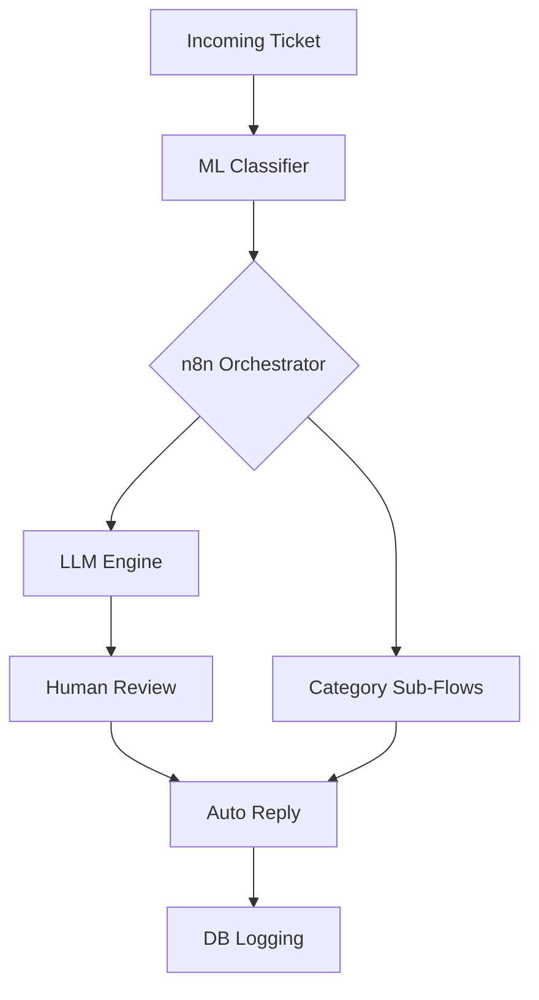

# ORDER MANAGEMENT

An enterprise-grade AI ticket automation system that combines ML classification, LLM reasoning, and n8n workflow orchestration to automatically triage, resolve, and respond to IT support tickets end-to-end.

## Goal

系统目标: 企业每天收到大量工单（IT、权限、设备故障、系统问题…），人工 triage（分类）浪费大量时间，且回复模板重复枯燥，低复杂度工单不需要人处理。严重事件识别延迟，达不到SLA（服务响应时间）。
AI 工单系统的目标就是：用 ML + LLM 自动处理 60–80% 工单，把剩下的复杂工单交给人工。
实际的 KPI：80% 工单自动分类，60% 工单自动回复草稿，30–40% 工单无须人工介入，SLA 提高 25–50%。

## System Architecture (Mermaid Diagram)

### Functions of Each Layer in the Architecture

🔹 **ML 层负责：**

* 工单分类（intent classification）
* 严重度预测（低/中/高）
* 判断是否调用 LLM
* 输出结构化数据（JSON）
  特点：快、稳定、可重复、成本低

🔹 **n8n 层（核心编排）负责：**

* Webhook 接收工单
* 调用分类模型
* 根据分类结果选择流程
* 决定何时调用 LLM
* 记录每步输入输出（可调试）
* LLM 错误 → 重试
* 超时 → fallback
* 发送 Email/Slack/系统

🔹 **LLM 层负责：**

* 根据 ML 结果生成高质量回复
* 给出故障排查步骤
* 输出结构化报告（原因/建议）
* 高严重度自动提醒团队

**n8n = 大脑（orchestration）
LLM = 智能（reasoning）
ML = 感知（classification）**

## Documentation

完整文档请参见 /docs：

- [ML Training Guide](./docs/ml_training.md)
- [System Architecture](./docs/architecture.md)
- [Data Format](./docs/data_format.md)
- [n8n Workflow](./docs/n8n_workflow.md)
- [LLM Prompts](./docs/llm_prompts.md)
